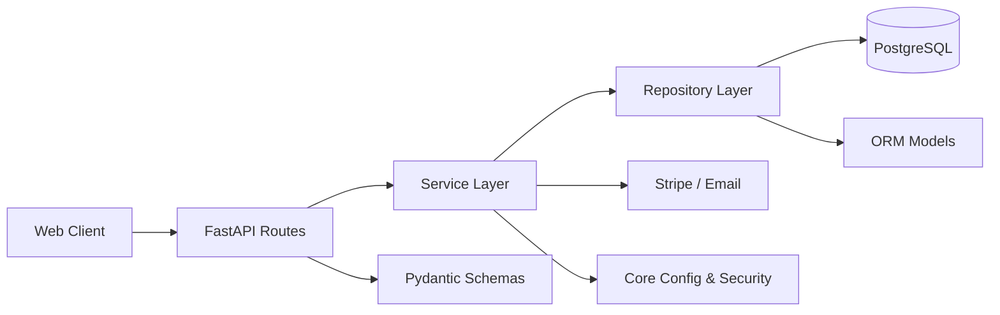

# RideSeat Backend

RideSeat is a cost-sharing ride platform where drivers post trips, passengers book seats, and payments are handled safely with background processing.

## Project Overview
- JWT-authenticated API for riders and drivers
- Trip creation and search with seat availability enforcement
- Booking lifecycle with state transitions and seat constraints
- Stripe Payment Intents with platform fee and driver payouts
- Background processing with Celery + Redis
- Reviews with aggregate rating on user profiles
- GCP storage for avatar uploads
- Admin endpoints for listings and metrics

## Core Workflows
1. User registers and verifies email, then logs in.
2. Driver creates a trip with seats and pricing.
3. Passenger searches trips and requests a booking.
4. Driver confirms booking and passenger pays.
5. After trip completion, payout is triggered and reviews are allowed.

## Architecture



Layering rules:
- routes: HTTP only
- services: business logic only
- repositories: database queries only
- models: ORM tables only
- schemas: validation/serialization only
- core: config, database, security, dependencies

## Tech Stack
- Python 3.11+
- FastAPI
- PostgreSQL
- SQLAlchemy or SQLModel
- Alembic
- JWT Auth
- Stripe Payments
- Pydantic v2

## Directory Structure
```
app/
├── main.py
├── api/v1/routes/
├── core/
├── models/
├── schemas/
├── repositories/
├── services/
└── utils/
```

## Setup
```bash
python -m venv .venv
.\.venv\Scripts\activate
pip install -r requirements.txt
```

## Run with Docker
```bash
docker compose up --build
```

## Environment Variables
```
DATABASE_URL=
JWT_SECRET_KEY=change_me
JWT_ALGORITHM=HS256
ACCESS_TOKEN_EXPIRE_MINUTES=
STRIPE_SECRET_KEY=
STRIPE_WEBHOOK_SECRET=
RESEND_API_KEY=
EMAIL_FROM=
FRONTEND_BASE_URL=
GOOGLE_CLIENT_ID=...
GOOGLE_CLIENT_SECRET=...
GCP_PROJECT_ID=rideseat
GCP_STORAGE_BUCKET=
GCP_CREDENTIALS_JSON={"type":"service_account",...}
ADMIN_EMAIL=
ADMIN_PASSWORD=
ADMIN_FIRST_NAME=Admin
ADMIN_LAST_NAME=User
CELERY_BROKER_URL=redis://redis:6379/0
CELERY_RESULT_BACKEND=redis://redis:6379/1
```

## Run
```bash
uvicorn app.main:app --reload
```

## Tests
```bash
pytest
```

## Background Processing
Payments and payouts are queued to Celery workers. Redis is used as broker and result backend.

## Admin
- Admin users can list users, trips, and bookings
- Metrics endpoint provides totals for users, trips, confirmed bookings, revenue, and platform fees

## Storage
User avatars are uploaded to GCP Cloud Storage and stored as public URLs on the user profile.

## API Endpoints (v1)

Authentication
- POST /api/v1/auth/register
- POST /api/v1/auth/login
- POST /api/v1/auth/google
- POST /api/v1/auth/verify-email
- POST /api/v1/auth/forgot-password
- POST /api/v1/auth/reset-password

Users
- GET /api/v1/users/me
- PUT /api/v1/users/me
- GET /api/v1/users/{user_id}

Trips
- POST /api/v1/trips
- GET /api/v1/trips/search
- GET /api/v1/trips/{trip_id}
- PUT /api/v1/trips/{trip_id}
- DELETE /api/v1/trips/{trip_id}

Bookings
- POST /api/v1/bookings
- GET /api/v1/bookings/me
- PATCH /api/v1/bookings/{id}/status
- POST /api/v1/bookings/{id}/cancel

Payments
- POST /api/v1/payments/intent
- POST /api/v1/payments/webhook
- GET /api/v1/payments/{booking_id}

Messaging
- GET /api/v1/messages/{booking_id}
- POST /api/v1/messages/{booking_id}

Reviews
- POST /api/v1/reviews
- GET /api/v1/reviews/user/{user_id}
