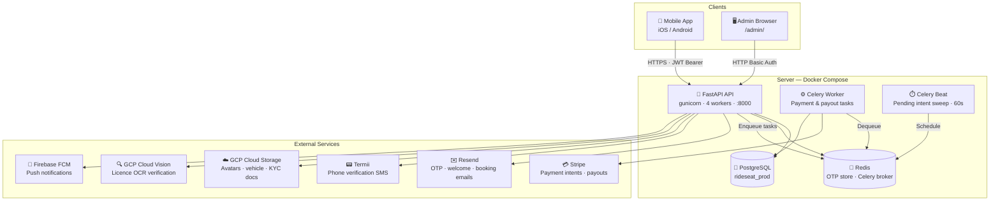
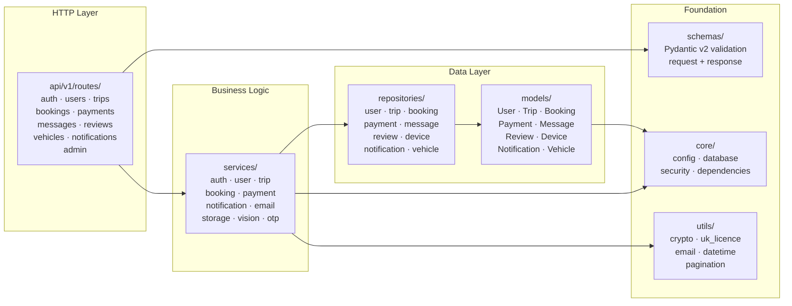
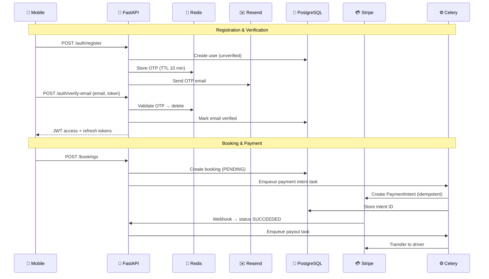

# Rideway Backend

Rideway is a UK cost-sharing ride platform. Drivers post trips, passengers book seats,
payments are processed via Stripe, and identity is verified against the UK DVLA licence format.

---

## System Architecture


```mermaid
graph TD
    subgraph Clients["Clients"]
        Mobile["📱 Mobile App\niOS / Android"]
        AdminBrowser["🖥️ Admin Browser\n/admin/"]
    end

    subgraph Server["Server — Docker Compose"]
        API["🚀 FastAPI API\ngunicorn · 4 workers · :8000"]
        Worker["⚙️ Celery Worker\nPayment & payout tasks"]
        Beat["⏱️ Celery Beat\nPending intent sweep · 60s"]
        PG[("🐘 PostgreSQL\nrideseat_prod")]
        Redis[("🔴 Redis\nOTP store · Celery broker")]
    end

    subgraph External["External Services"]
        Resend["✉️ Resend\nOTP · welcome · booking emails"]
        Termii["📟 Termii\nPhone verification SMS"]
        Stripe["💳 Stripe\nPayment intents · payouts"]
        GCS["☁️ GCP Cloud Storage\nAvatars · vehicle · KYC docs"]
        Vision["🔍 GCP Cloud Vision\nLicence OCR verification"]
        FCM["🔔 Firebase FCM\nPush notifications"]
    end

    Mobile  -->|"HTTPS · JWT Bearer"| API
    AdminBrowser -->|"HTTP Basic Auth"| API

    API --> PG
    API --> Redis
    API -->|"Enqueue tasks"| Redis
    API --> Resend
    API --> Termii
    API --> GCS
    API --> Vision
    API --> FCM

    Worker -->|"Dequeue"| Redis
    Worker --> Stripe
    Worker --> PG

    Beat -->|"Schedule"| Redis
```

---

## Internal Layer Architecture


```mermaid
graph LR
    subgraph HTTP["HTTP Layer"]
        Routes["api/v1/routes/\nauth · users · trips\nbookings · payments\nmessages · reviews\nvehicles · notifications\nadmin"]
    end

    subgraph Logic["Business Logic"]
        Services["services/\nauth · user · trip\nbooking · payment\nnotification · email\nstorage · vision · otp"]
    end

    subgraph Data["Data Layer"]
        Repos["repositories/\nuser · trip · booking\npayment · message\nreview · device\nnotification · vehicle"]
        Models["models/\nUser · Trip · Booking\nPayment · Message\nReview · Device\nNotification · Vehicle"]
    end

    subgraph Foundation["Foundation"]
        Core["core/\nconfig · database\nsecurity · dependencies"]
        Schemas["schemas/\nPydantic v2 validation\nrequest + response"]
        Utils["utils/\ncrypto · uk_licence\nemail · datetime\npagination"]
    end

    Routes --> Schemas
    Routes --> Services
    Services --> Repos
    Repos --> Models
    Models --> Core
    Services --> Core
    Services --> Utils
```

---

## Key Flows


```mermaid
sequenceDiagram
    participant App as 📱 Mobile
    participant API as 🚀 FastAPI
    participant Redis as 🔴 Redis
    participant Email as ✉️ Resend
    participant DB as 🐘 PostgreSQL
    participant Stripe as 💳 Stripe
    participant Worker as ⚙️ Celery

    Note over App,Worker: Registration & Verification
    App->>API: POST /auth/register
    API->>DB: Create user (unverified)
    API->>Redis: Store OTP (TTL 10 min)
    API->>Email: Send OTP email
    App->>API: POST /auth/verify-email {email, token}
    API->>Redis: Validate OTP → delete
    API->>DB: Mark email verified
    API-->>App: JWT access + refresh tokens

    Note over App,Worker: Booking & Payment
    App->>API: POST /bookings
    API->>DB: Create booking (PENDING)
    API->>Worker: Enqueue payment intent task
    Worker->>Stripe: Create PaymentIntent (idempotent)
    Worker->>DB: Store intent ID
    Stripe->>API: Webhook → status SUCCEEDED
    API->>Worker: Enqueue payout task
    Worker->>Stripe: Transfer to driver
```

---

## Tech Stack

| Layer | Technology |
|---|---|
| Runtime | Python 3.11 |
| Framework | FastAPI + Pydantic v2 |
| Database | PostgreSQL 16 (SQLAlchemy 2 ORM) |
| Migrations | Alembic |
| Auth | JWT (python-jose) + bcrypt |
| Background | Celery + Redis |
| Payments | Stripe (PaymentIntents + Transfers) |
| Email | Resend |
| SMS | Termii |
| Storage | Google Cloud Storage |
| OCR | Google Cloud Vision |
| Push | Firebase Cloud Messaging (FCM) |
| Encryption | Fernet AES-128 (GDPR field-level) |
| Containers | Docker Compose (5 services) |

---

## Container Setup

```
┌─────────────────────────────────────────────┐
│  docker-compose.yml                         │
│                                             │
│  postgres   ──healthcheck──►  api           │
│  redis      ──healthcheck──►  celery_worker │
│                           ──►  celery_beat  │
└─────────────────────────────────────────────┘
```

All containers start in the correct order via `depends_on` + `healthcheck`.
The `api` entrypoint runs `alembic upgrade head` before gunicorn boots.

---

## Environment Variables

```env
# Database
POSTGRES_DB=rideseat_prod
POSTGRES_USER=rideseat
POSTGRES_PASSWORD=
DATABASE_URL=

# Redis
REDIS_PASSWORD=
CELERY_BROKER_URL=
CELERY_RESULT_BACKEND=
# Auth
JWT_SECRET_KEY=
JWT_ALGORITHM=HS256
ACCESS_TOKEN_EXPIRE_MINUTES=30
REFRESH_TOKEN_EXPIRE_DAYS=30

# GDPR field encryption
FIELD_ENCRYPTION_KEY=

# Admin (auto-created at startup)
ADMIN_EMAIL=
ADMIN_PASSWORD=
ADMIN_FIRST_NAME=
ADMIN_LAST_NAME=

# Email
RESEND_API_KEY=
EMAIL_FROM=

# SMS
TERMII_API_KEY=
TERMII_SENDER_ID=
TERMII_BASE_URL=https://api.ng.termii.com

# Payments
STRIPE_SECRET_KEY=
STRIPE_WEBHOOK_SECRET=

# GCP (Storage + Vision + FCM — single service account)
GCP_PROJECT_ID=
GCP_STORAGE_BUCKET=
GCP_CREDENTIALS_JSON=

# App
FRONTEND_BASE_URL=
GOOGLE_CLIENT_ID=
GOOGLE_CLIENT_SECRET=
MOBILE_APP_SCHEME=
```

> Services degrade gracefully when not configured — the app boots and `/health` responds
> regardless. Each missing service returns a clean `400` only on the endpoints that need it.

---

## API Endpoints

### Auth
| Method | Path | Description |
|---|---|---|
| POST | `/api/v1/auth/register` | Register — sends OTP via email |
| POST | `/api/v1/auth/verify-email` | Verify OTP `{email, token}` → JWT |
| POST | `/api/v1/auth/resend-otp` | Resend verification OTP |
| POST | `/api/v1/auth/login` | Login → JWT |
| POST | `/api/v1/auth/forgot-password` | Send password reset OTP |
| POST | `/api/v1/auth/reset-password` | Reset with `{email, token, new_password}` |
| POST | `/api/v1/auth/google` | Google OAuth (web) |
| POST | `/api/v1/auth/google/mobile` | Google OAuth (mobile) |

### Users
| Method | Path | Description |
|---|---|---|
| GET | `/api/v1/users/me` | My profile |
| PUT | `/api/v1/users/me` | Update profile |
| POST | `/api/v1/users/me/avatar` | Upload avatar |
| POST | `/api/v1/users/me/phone/request` | Request phone OTP (Termii) |
| POST | `/api/v1/users/me/phone/verify` | Verify phone OTP |
| POST | `/api/v1/users/me/verification/driver-licence` | Submit driving licence + OCR |
| POST | `/api/v1/users/me/verification/selfie` | Submit selfie |
| POST | `/api/v1/users/me/verification/id-document` | Submit ID document |
| GET | `/api/v1/users/{user_id}` | Public profile |
| GET | `/api/v1/users/{user_id}/phone` | Driver fetches verified passenger phone |
| GET | `/api/v1/users/me/referral` | Referral link |

### Vehicles
| Method | Path | Description |
|---|---|---|
| POST | `/api/v1/users/me/vehicles` | Add vehicle |
| GET | `/api/v1/users/me/vehicles` | List my vehicles |
| PUT | `/api/v1/users/me/vehicles/{id}` | Update vehicle |
| PUT | `/api/v1/users/me/vehicles/{id}/default` | Set default vehicle |
| DELETE | `/api/v1/users/me/vehicles/{id}` | Remove vehicle |

### Trips
| Method | Path | Description |
|---|---|---|
| POST | `/api/v1/trips` | Create trip |
| GET | `/api/v1/trips/search` | Search trips (city, date, sort) |
| GET | `/api/v1/trips/{id}` | Trip detail |
| PUT | `/api/v1/trips/{id}` | Update trip |
| DELETE | `/api/v1/trips/{id}` | Cancel trip |

### Bookings
| Method | Path | Description |
|---|---|---|
| POST | `/api/v1/bookings` | Request booking |
| GET | `/api/v1/bookings/me` | My bookings (passenger) |
| GET | `/api/v1/bookings/driver` | My bookings (driver) |
| PATCH | `/api/v1/bookings/{id}/status` | Update booking status |
| POST | `/api/v1/bookings/{id}/cancel` | Cancel booking |

### Payments
| Method | Path | Description |
|---|---|---|
| POST | `/api/v1/payments/intent` | Create payment intent (async via Celery) |
| POST | `/api/v1/payments/webhook` | Stripe webhook |
| GET | `/api/v1/payments/{booking_id}` | Payment status |
| GET | `/api/v1/payments/history` | Payment history |

### Messages & Reviews
| Method | Path | Description |
|---|---|---|
| GET | `/api/v1/messages/{booking_id}` | Thread messages |
| POST | `/api/v1/messages/{booking_id}` | Send message |
| POST | `/api/v1/reviews` | Leave review |
| GET | `/api/v1/reviews/user/{user_id}` | User reviews |

### Notifications
| Method | Path | Description |
|---|---|---|
| GET | `/api/v1/notifications` | My notifications |
| POST | `/api/v1/notifications/{id}/read` | Mark as read |
| POST | `/api/v1/notifications/devices/register` | Register FCM token |

### Admin API
| Method | Path | Description |
|---|---|---|
| GET | `/api/v1/admin/users` | List all users |
| GET | `/api/v1/admin/trips` | List all trips |
| GET | `/api/v1/admin/bookings` | List all bookings |
| GET | `/api/v1/admin/metrics` | Platform metrics |
| POST | `/api/v1/admin/users/{id}/verification/approve` | Approve driver identity |
| POST | `/api/v1/admin/users/{id}/verification/reject` | Reject driver identity |

### Admin Dashboard (web)
| Method | Path | Description |
|---|---|---|
| GET | `/admin/` | Verification queue (HTTP Basic Auth) |
| POST | `/admin/users/{id}/approve` | Approve from dashboard |
| POST | `/admin/users/{id}/reject` | Reject from dashboard |

---

## Running Tests

```bash
PYTHONPATH=. DATABASE_URL=sqlite:///./test.db pytest tests/ -q
```

102 tests — unit + smoke tests covering all endpoints with external services mocked.

---

## Deployment

See [setup.md](setup.md) for the full step-by-step server deployment guide.

```bash
# Quick start
git clone <repo> /opt/rideway && cd /opt/rideway
cp .env.example .env  # fill in values
docker compose up -d --build
docker compose exec api alembic upgrade head
```
